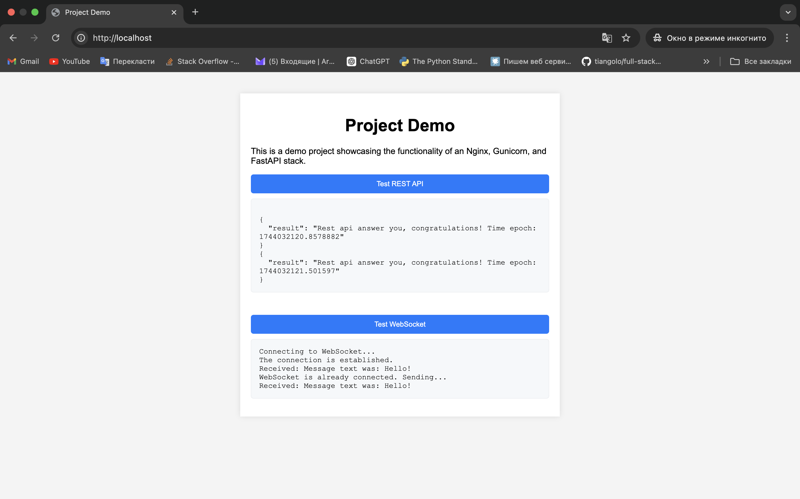
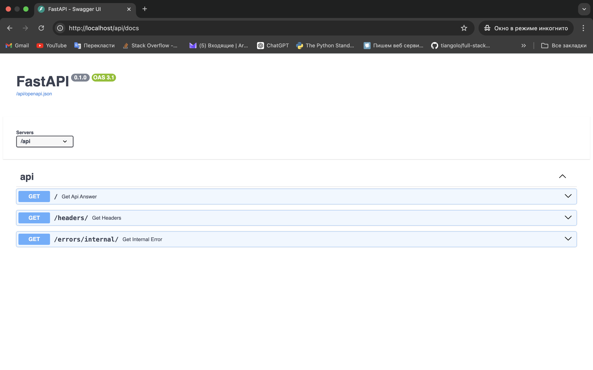

# Production-Ready FastAPI Template with NGINX, Gunicorn & WebSocket Support

This project is a clean and extensible starter template for deploying Python web applications in production using **NGINX**, **Gunicorn** (with `UvicornWorker`), and **FastAPI**.

- **NGINX** handles static files, reverse proxying, and HTTP/WebSocket routing.
- **Gunicorn** ensures reliable performance for both standard HTTP requests and persistent WebSocket connections.
- **FastAPI** serves as the backend framework, ready to scale and integrate with other functionalities.

Designed to be simple yet powerful, this setup offers a production-grade infrastructure out of the box — ideal for developers who want to focus on features, not boilerplate.

---

## Project Visualization


<br><br>


---

## Example Usage

### Start the Application
```sh
make up
```

### Stop the Application
```sh
make down
```

### Stop and Remove Containers with Volumes
```sh
make full_down
```

### Restart NGINX
```sh
make nginx_restart
```

---

## API & Debug Endpoints

### Test HTTP Request
```sh
curl -i -X GET http://localhost/api/
```

### Test WebSocket Connection
Use a browser or WebSocket client (e.g. Postman) at:
```
ws://localhost/ws/
```

### Trigger Unhandled Exception (for logging test)
```sh
curl -i -X GET http://localhost/api/errors/internal/
```

### View Headers Received from Proxy
```sh
curl -i -X GET http://localhost/api/headers/
```

---

## Implementation Details

### `Makefile`
Simplifies Docker operations:
- Start all services in detached mode with rebuilds
- Stop containers cleanly
- Remove containers and volumes
- Restart NGINX only

---

### `backend.env.template`
Environment variable template for `.backend.env`:
- Defines variables required by the Python application
- Compatible with Docker Compose

---

### `nginx.env.template`
Environment variable template for `.nginx.env`:
- Contains timezone configuration (`TZ`)
- Ensures correct timestamps in logs

---

### `nginx.conf`
Production-ready NGINX configuration:
- Efficient routing of HTTP and WebSocket traffic
- Uses Unix socket for backend proxying
- Serves static files directly
- Gzip compression enabled
- Rejects requests without `Host` header
- Handles large request bodies (up to 4 GB)
- Custom error pages and logging

---

### `docker-compose.yml`
Defines all services and infrastructure:
- Builds backend image from `./backend`
- Uses shared Unix socket volume for communication
- Mounts static files for NGINX
- Sets up logging with rotation
- Uses `.env` files for service-specific configs
- Exposes services on port 80

---

### `src/`
Holds static frontend files served by NGINX.

> **Note:** Not optimized for frontend best practices. Focus is on backend.

---

### `backend/`
Contains the backend Python app: source code, dependencies, and configuration.

---

### `backend/Dockerfile`
Multi-stage build for backend service:
- Minimal `python:3.10.11-slim` image
- Uses Poetry for dependency management
- Installs only production dependencies
- Cleans up build-time tools and cache
- Runs via `scripts/entrypoint.sh`

---

### `backend/pyproject.toml`
Poetry configuration:
- Defines metadata and dependencies
- Encourages safe version ranges (e.g. `^1.2.3`)
- Matches Python version with Docker image
- Uses `poetry-core` build backend

---

### `backend/scripts/`
Contains utility and startup scripts.

---

### `backend/scripts/gunicorn.conf.sh`
Configures Gunicorn dynamically:
- Sets default production-ready values
- Auto-calculates worker count
- Supports overrides via environment variables
- Centralizes runtime config logic

---

### `backend/scripts/entrypoint.sh`
Container entrypoint script:
- Launches Gunicorn with config from env variables
- Centralized startup logic
- Avoids hardcoding in Dockerfile/Compose

---

### `backend/app/`
Contains core Python app: routes, models, config, etc.

---

### `backend/app/main.py`
Main entry point and logger setup for the FastAPI app.

---

### `backend/app/config.py`
Environment-based configuration using Pydantic:
- Validates and loads env variables
- Provides access to API prefix, domain, stage
- Supports subdomain list and case-insensitive keys

---

### `backend/app/exception.py`
Global exception handler:
- Logs unhandled errors via `app.error`
- Returns standard `500` JSON response
- Avoids exposing sensitive data

---

### `backend/app/setup.py`
App factory function:
- Applies `root_path`, middleware, routers
- Adds CORS and proxy header support
- Registers global error handler

---

### `backend/app/logger.py`
Logging configuration for app and Gunicorn:
- Unified log format with timestamp and context
- Dynamic log level (debug vs production)
- Custom Gunicorn logger with formatters
- Streams logs to stdout/stderr

---

### `backend/app/router.py`
Declares routes for API and WebSocket endpoints.